# WE 3D 渲染引擎 webGPU engine 3D

WE3D包括基础引擎和编辑器两大部分。（目前WE3D处于初期开发阶段，功能、模块与结构会频繁调整。）

1. 基础引擎部分包括：核心功能、图形学功能、模型功能、物理引擎整合、动画管理五个模块。本项目：[https://github.com/WebgpuEngine/WE3D](https://)
2. 编辑器部分包括：材质编辑器、动画编辑器、场景编辑器，构建管理器四个模块，以实现可视化工作。（在[https://github.com/WebgpuEngine/editor](https://) 部分，todo）
3. 演示Demo todo [https://github.com/WebgpuEngine/WE3D_Demo](https://)
4. 文档 todo [https://github.com/WebgpuEngine/WE3D_DOC](https://)
5. WE3D后期还会有后端服务，以实现支持服务器端活链接、USD、Nerf工作流、三维重构等以及和期望实现的图形学大模型AI工作流等。

WE3D includes two parts: the base engine and the editor. (WE3D is currently in the early development stage, and the functions, modules and structure will be frequently adjusted.) ）

1. The basic engine part includes five modules: core functions, graphics functions, model functions, physics engine integration, and animation management. This item: [https://github.com/WebgpuEngine/WE3D](https:)
2. The editor part includes: material editor, animation editor, scene editor, and build manager to achieve visualization work. (In [the https://github.com/WebgpuEngine/editor](https:) section, todo)
3. Demo todo  [https://github.com/WebgpuEngine/WE3D\_Demo](https:)
4. document todo [https://github.com/WebgpuEngine/WE3D\_DOC](https:)
5. In the later stage of WE3D, there will also be back-end services to support server-side live links, USD, Nerf workflows, 3D reconstruction, etc., as well as the expected graphics large model AI workflows.

# 引擎基础说明 Engine Basics Description

* WE 3D是使用typescript 和webGPU API 开发的web 端三维渲染引擎
* 在引擎基础部分涵盖场景、实体、纹理、材质、摄像机、光源、阴影、后处理、ECS、GPU拾取、AA、颜色空间、tonemapping、延迟渲染、BVH等；
* 在图形学的功能包括：IBL、SSGI、SSR、SSAO等
* 在物理引擎 上使用rapier进行物理引擎工作；
* 在模型部分：涉及gltf、obj、fbx等模型；
* 动画管理部分涵盖:关键帧、骨骼动画、变形模板、VAT、粒子系统等；
* 在渲染引擎的架构上是从底层独立设计与实现的，参考了Babylon、three、cesium、ue等；
* 在底层机制以command集合（Draw Command、Compute Command、Copy Command）进行shader提交；
* 在更新机制与事件机制上，有多途径的update机制和onEvent处理；
* WE 3D is a web-side 3D rendering engine developed using typescript and webGPU APIs
* The basic part of the engine covers scenes, solids, textures, materials, cameras, light sources, shadows, post-processing, ECS, GPU pickup, AA, color space, tonemapping, deferred rendering, BVH, etc.
* The functions in graphics include: IBL, SSGI, SSR, SSAO, etc
* Use Rapier on the Physics Engine for physics engine work;
* In the model part: involving gltf, obj, fbx and other models;
* The animation management section covers: keyframes, skeletal animations, deformation templates, VAT, particle systems, etc.;
* The architecture of the rendering engine is independently designed and implemented from the bottom up, referring to Babylon, three, cesium, ue, etc.
* Shader submission is carried out with the command collection (Draw Command, Compute Command, Copy Command) in the underlying mechanism.
* In terms of update mechanism and event mechanism, there are multiple ways to handle update mechanism and onEvent.

# 更多功能说明 More feature descriptions

* 支持sRGB和display P3的颜色空间，WE3D内部以linear的线性空间进行工作，支持多种模式的色彩映射输出；
* 光源支持环境光、方向光、点光源、聚光灯、面积光；
* 阴影实现以shadow map基础，支持PCSS;
* 在深度上支持正向Z和reveredZ，默认开启reversedZ;
* 支持MSAA，FXAA，并预计实现TAA。目前MSAA与延迟渲染不能同时使用（后期可能改进边缘检测后，支持同时使用）；
* 渲染模式支持前向渲染和延迟渲，透明物体渲染支持alpha透明和物理透明；
* 在渲染的GBuffer使用了多通道（单点56bit），数据覆盖color、depth、position、normal、albedo、roughness、metallic、ao、emissive、material、id等；
* 实体上支持mesh、lines、points，sprite，并支持实例化，在数据属性多种形式的属性组合的数组形式和ArrayBuffer形式数据；
* 在模型上支持gltf、obj、fbx等（进行中）。同时支持仿真数据、体渲染数据，并预计支持地理空间数据(todo);
* 材质支持简单材质、blinn-phong、PBR 材质；
* 摄像机支持正交与透视，且支持viewpot模式，多摄像机，多视图等；
* 拾取(pickup)支持两种模式，GPU端和CPU端，默认使用GPU端的拾取功能，CPU的ray功能配合BVH和物理引擎实现；
* 物理引擎整合rapier为主（进行中）；
* 渲染管理器内部支持多通道，涉及：计算、纹理、材质、渲染目标、不透明阴影、透明阴影、深度、MSAA、前向渲染、延迟渲染、透明渲染、sprite、sprite透明、toneMapping、后处理、ui、stage等诸多通道。各个通道会包括有内容线和时间线两种工作模式；
* 后处理是在有管理器和后处理功能组成，目前有FXAA，blue，colordemo等；
* stage有四个：默认的world，ui、stage1(导航等)，stage2（地图等）；
* ECS应用的比较多，比如实体、材质、光影、摄像机、输入管理、动画、纹理等都是采用的ECS的概念进行管理；
* todo：粒子系统，动画系统、SSGI、SSR、SSAO、TAA、
* Support sRGB and display P3 color space, WE3D works in linear linear space internally, and supports color mapping output in multiple modes;
* The light source supports ambient light, directional light, point light source, spotlight, and area light;
* The shadow implementation is based on shadow map and supports PCSS.
* Forward Z and reveredZ are supported in depth, and reversedZ is enabled by default.
* MSAA and FXAA are supported, and TAA is expected to be implemented. Currently, MSAA and deferred rendering cannot be used at the same time (edge detection may be improved later, and can be used at the same time);
* Rendering modes support forward rendering and delayed rendering, and transparent object rendering supports alpha transparency and physical transparency.
* GBuffer one pixel  use 56bit ，include color、depth、position、normal、albedo、roughness、metallic、ao、emissive、material、id；
* It supports mesh, lines, points, and sprite on the entity, and supports instantiation, in the form of arrays and arrayBuffer data in the form of multiple forms of attributes of data attributes.
* It supports GLTF, OBJ, FBX, etc. on the model (in progress). It also supports simulation data, volume rendering data, and is expected to support geospatial data (TODO).
* The material supports simple material, blinn-phong, and PBR material;
* The camera supports orthogonal and perspective, and supports viewpot mode, multi-camera, multi-view, etc.;
* Pickup supports two modes, GPU and CPU, using the GPU pickup function by default, and the CPU ray function is implemented with BVH and physics engine.
* Physics engine integration is mainly Rapier (in progress);
* The render manager supports multiple channels, including: calculation, texture, material, render target, opaque shadow, transparent shadow, depth, MSAA, forward rendering, delayed rendering, transparent rendering, sprite, sprite transparency, toneMapping, post-processing, UI, stage, and many other channels. Each channel will include two working modes: content line and timeline.
* Post-processing is composed of manager and post-processing functions, currently there are FXAA, blue, colordemo, etc.;
* There are four stages: default world, ui, stage1 (navigation, etc.), stage2 (maps, etc.);
* ECS is used in many applications, such as entities, materials, light and shadow, cameras, input management, animation, textures, etc. are all managed by the concept of ECS;
* todo: Particle System, Animation System, SSGI, SSR, SSAO, TAA,

# 简单示例 Simple example

| ReversedZ                                         | material alpha blend                             | pixel level alpha transparent material           |
| ------------------------------------------------- | ------------------------------------------------- | ------------------------------------------------- |
|  | 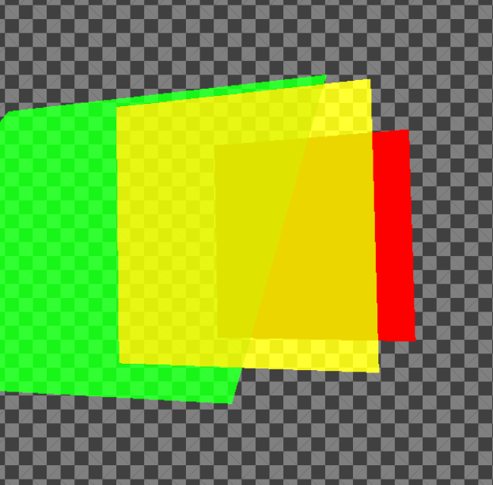 | 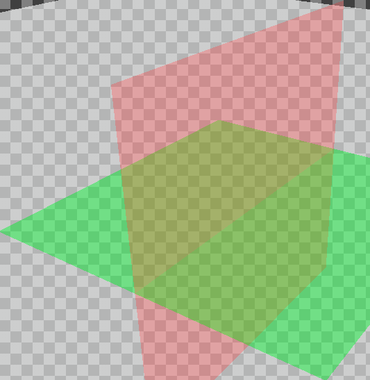 |
| 高光纹理 specular texture                         | 视差纹理 parallax texture                         | 法线纹理 normal texture                           |
| 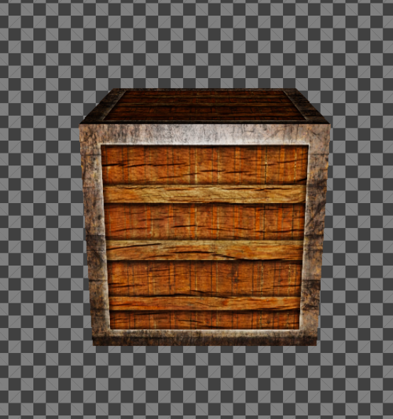 | 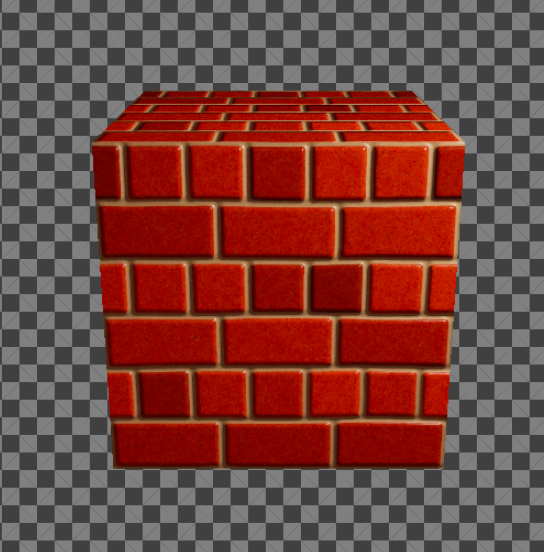 | 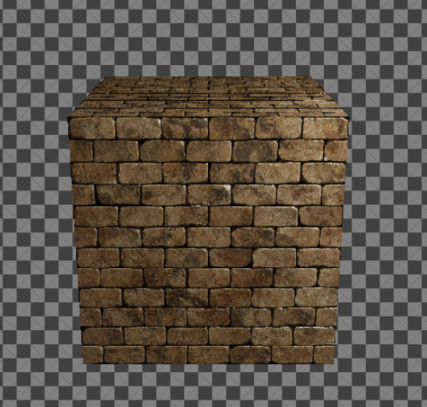 |
| direction light +PCSS shadow                      | point light+PCSS shadow                           | spot light +PCSS shadow                           |
|  |  |  |
| 点光源+视差纹理                                   | viewpot                                           | PBR                                               |
|  |  | 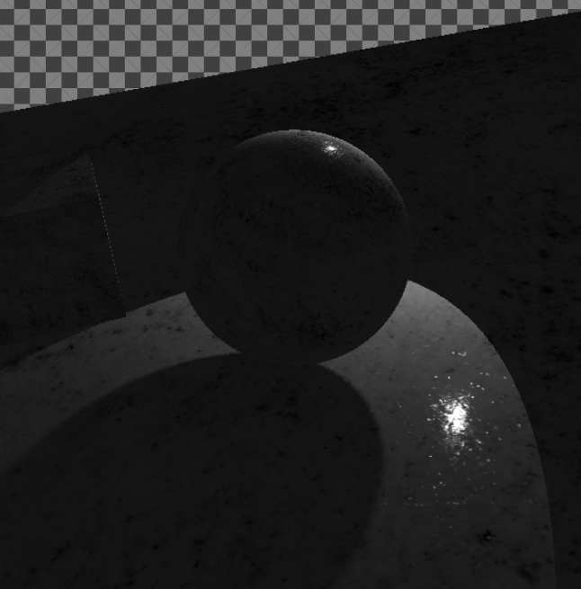 |
| PBR                                               | PBR+spot+shadow                                   | PBR+point light+shadow                            |
|  | 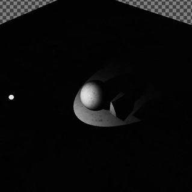 | 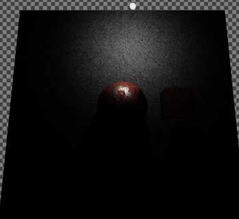 |
| 1024个光源                                        | MSAA                                              | FXAA                                              |
|  | 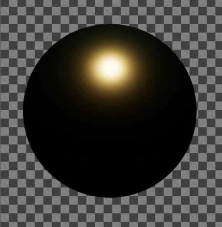 | 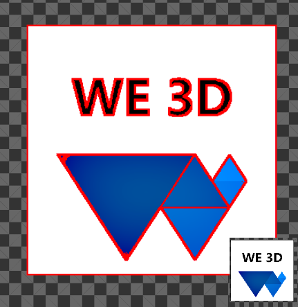 |
| post process blue 3*3                             | post process red to 1                             | 延迟渲染 deferRender：PBR                         |
| 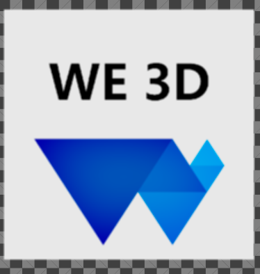 | 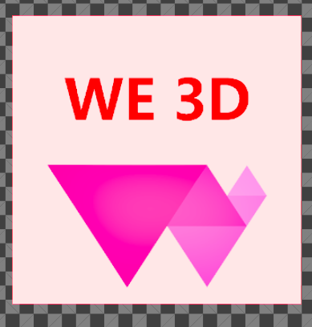 | 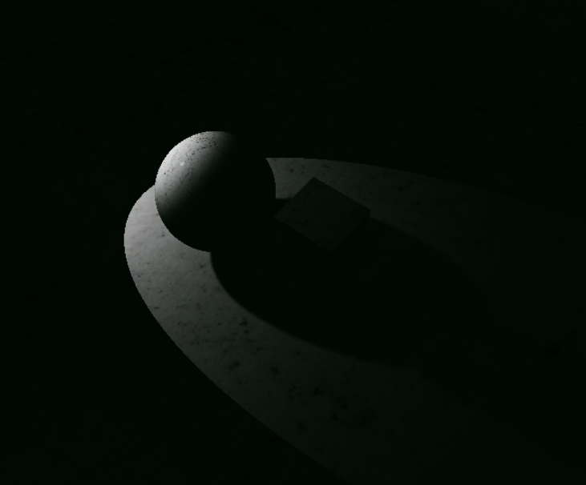 |
| 延迟渲染 deferRender：PBR                         | 延迟渲染 deferRebder：BlinnPhong                  | 延迟渲染 deferRebder：BlinnPhong                  |
| 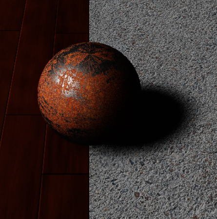 | 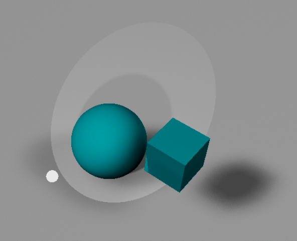 | 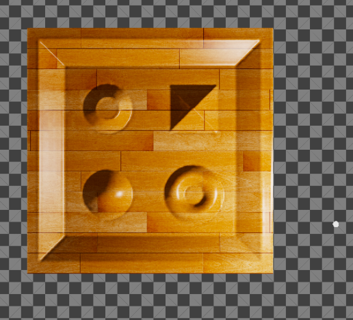 |
|                                                   |                                                   |                                                   |

# 资料参考与推荐 Information reference and recommendation

* webGPU标准：https://www.w3.org/TR/webgpu/
* WGSL的标准：https://www.w3.org/TR/wgsl/
* 非常好示例：https://github.com/webgpu/webgpu-samples
* google的Dawn：https://github.com/google/dawn
* Mozilla的wGPU：https://github.com/gfx-rs/wgpu
* MDN的webGPU文档：https://developer.mozilla.org/zh-CN/docs/Web/API/WebGPU_API
* 非常好的webGPU教程：https://webgpufundamentals.org/
* 非常好的webGL2教程：https://webgl2fundamentals.org/
* 非常好的webGL1教程：https://webglfundamentals.org/
* dawn 的C示例：https://github.com/samdauwe/webgpu-native-examples
* 非常实用的JS端的图形学简单数学库，这是目前主要使用的库：https://github.com/greggman/wgpu-matrix
* 另外一个经典的图形学数学库：https://github.com/toji/gl-matrix
* webGPU Samples https://webgpu.github.io/webgpu-samples/
* WebGPU API reference，方便实用：https://gpuweb.github.io/types/index.html
* webgpu-utils可以参考一下：https://github.com/greggman/webgpu-utils
* filament可以学习与参考一些：https://github.com/google/filament
* PBRT书籍，非常好：https://www.pbr-book.org/
* Ray tracing的书籍：https://raytracing.github.io/
* nvidia的书籍：https://developer.nvidia.com/gpugems/gpugems/contributors
* gltf文档 https://registry.khronos.org/glTF/specs/2.0/
* gltf tutorials  https://github.com/KhronosGroup/glTF-Tutorials
* rapier [Rapier physics engine | Rapier](https://rapier.rs/)
* [Bullet Real-Time Physics Simulation](https://pybullet.org/wordpress/)  https://pybullet.org/
* CSS Color Module Level 4 https://www.w3.org/TR/css-color-4/
* [Self Shadow](https://blog.selfshadow.com/)
